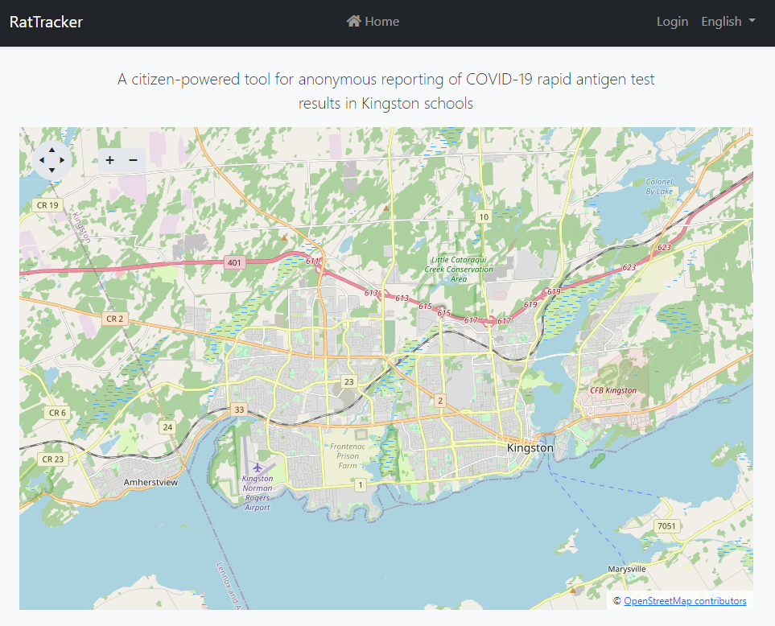

# COVID-19 Crowdsourced RatTracker
A COVID-19 Rapid Antigen Test (RAT) tracker which allows people to self report their test results and give people at least some idea of numbers in schools.

Inspired by the work here https://thelocal.to/rat-tracker but I'm using some personal and professional experience here to bolster it's usefulness.

## Requirements

- [X] School addresses entered into the system
- [X] Geocoding addresses so that pins can be placed on the map
- [X] PII needs to be non-existent, to make this as deployable as possible.
- [ ] Needs to record Rapid Antigen Test (RAT) results.
- [ ] A map needs to be generated showing results by school.
- [ ] Verification, in some fashion. Possibly temporal QR code, take picture of RAT beside code to verify. Pictures are not stored, only processed.
- [ ] (optional) Quick Mobile app? Or at the VERY least something that's usable on mobile easily.
- [ ] (optional) Push notifications, daily, weekly showing changes.
- [ ] (optional) Webhooks for those who might care.

## Technology

I'll be utilizing the following for this project:

- https://abp.io
- https://dot.net (net6)
- Telerik by Progress (Map, Fancy Stuff)
- Microsoft Azure (Hosting)

